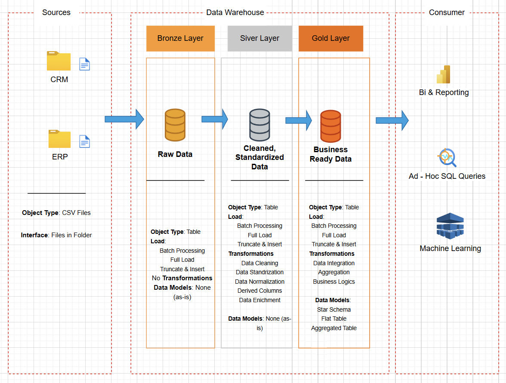

# Data Warehouse and Analytics Project 🚀
Welcome to the Data Warehouse and Analytics Project repository!

This project presents a full-stack data warehousing and analytics solution — from raw data ingestion to business intelligence reporting. It's designed as a portfolio project to demonstrate core concepts and best practices in data engineering, SQL-based data warehousing, and analytics.

# 🏗️ Data Architecture (Medallion Architecture)
This project adopts the Medallion Architecture framework, organizing data into three structured layers for efficient processing and analysis:

## Medallion Architecture

🔹 Bronze Layer
Raw data is ingested directly from the source systems (CSV files) into the SQL Server database without transformations. This layer serves as the single source of truth and preserves data in its original state.

🔸 Silver Layer
In this stage, data undergoes cleansing, validation, and standardization. It’s transformed into a more structured and queryable format, ensuring consistency and quality for downstream analytics.

🏅 Gold Layer
The final layer contains business-ready, aggregated data modeled into a star schema. This layer is optimized for reporting, dashboarding, and generating actionable insights.

## 📖 Project Overview

This project covers the following components:

- **Data Architecture**: Implementation of a modern data warehouse using the Medallion Architecture, structured into Bronze, Silver, and Gold layers.
- **ETL Pipelines**: Processes for extracting, transforming, and loading data from source systems into the warehouse.
- **Data Modeling**: Design of fact and dimension tables optimized for analytical workloads.
- **Analytics & Reporting**: Development of SQL-based reports and dashboards to generate actionable insights.

## 🎯 Target Audience

This repository is ideal for professionals and students aiming to showcase their skills in:

- SQL Development  
- Data Architecture  
- Data Engineering  
- ETL Pipeline Development  
- Data Modeling  
- Data Analytics
