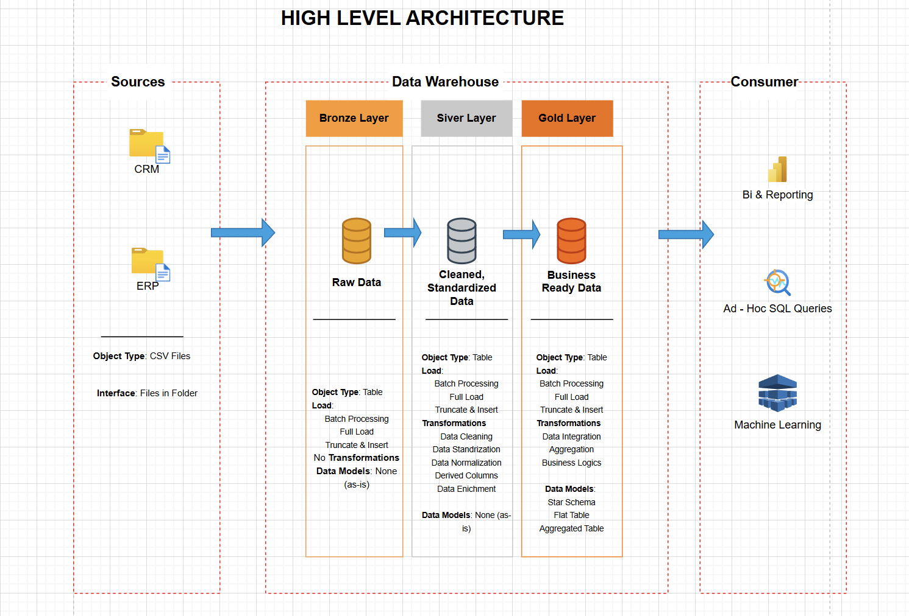

# 🚀 Data Warehouse Project

A **portfolio-ready** demonstration of the **end-to-end data lifecycle** — from raw data ingestion to actionable business insights — using a modern **Medallion Architecture**.  
This project highlights **data engineering, warehousing, and analytics** best practices while remaining **easy to understand, reproduce, and extend**.

---

## 🏗️ Data Architecture: Medallion Framework

This project adopts the **Medallion Architecture** to deliver a scalable, maintainable, and quality-focused data flow.

### Layers

| Layer      | Description                                                                                          |
| ---------- | ---------------------------------------------------------------------------------------------------- |
| **Bronze** | Raw data ingested *as-is* from ERP & CRM CSV files into SQL Server — acts as the single source of truth. |
| **Silver** | Cleansed and standardized data, ensuring consistent formatting and integrity.                         |
| **Gold**   | Business-ready, aggregated data modeled in a **star schema** optimized for analytics & reporting.     |

---

## 📚 Project Features

- **Data Architecture** — Robust Bronze → Silver → Gold warehouse design.
- **ETL Pipelines** — Automated CSV ingestion and transformation in SQL Server.
- **Data Modeling** — Fact & dimension tables following BI best practices.
- **Analytics & Reporting** — SQL-based insights on customers, products, and sales KPIs.

---

## 🎯 Who This Project Is For

✅ Data Engineers showcasing SQL & warehouse design skills  
✅ Data Analysts building structured datasets for BI  
✅ Students & professionals creating portfolio-ready projects  

---

## ⚙️ Technical Details

**Data Sources:**  
- ERP System (Products, Sales) — CSV export  
- CRM System (Customers) — CSV export  

**Tech Stack:**  
- Microsoft SQL Server  
- T-SQL for ETL, transformations, and reporting  
- Star schema modeling principles  

**Objectives:**  
1. Consolidate sales & customer data in a SQL Server warehouse  
2. Cleanse and validate source data for quality  
3. Integrate sources into a unified, query-optimized model  
4. Build analytics queries to deliver actionable insights  

---

## 🚀 Quick Start

**Prerequisites**
- [SQL Server](https://www.microsoft.com/en-us/sql-server) installed locally or on a server
- Basic knowledge of T-SQL
- ERP & CRM CSV files 

## 📜 License

MIT — see the [LICENSE](LICENSE) file.

---

## 🌟 About Me

I’m **Daniel Toluwani Adeleke**, a Data Scientist & IT professional with a passion for building **end-to-end data solutions**.
I hold a **BSc in Computer Science** and an **MSc in Data Science & Business Analytics**. My expertise includes SQL, Python, Machine Learning, and BI reporting.

📧 **Email:** [dannydave1000@gmail.com](mailto:dannydave1000@gmail.com)
💼 **LinkedIn:** [linkedin.com/in/dannydave](https://www.linkedin.com/in/leke98)
🌐 **Portfolio:** [dannydave.my_portfolio.github.io](https://dannydave.github.io/my_portfolio.github.io/)

